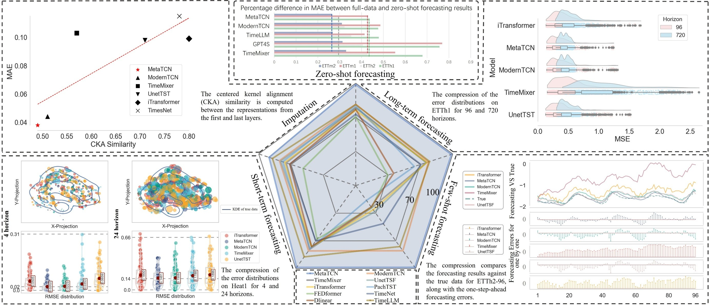

# MetaTCN
A novel meta-convolution structure for time series forecasting. 

## Our Paper
ModernTCN enhances this by introducing a Larger ERF (LERF) to better capture extended temporal patterns. However, this improvement leads to the Forgetting-Knowledge Dilemma, caused by cognitive saturation—where redundant features overload the model’s capacity—and representational dilution—where non-discriminative features diminish the importance of critical patterns. These factors create a cycle of information overload and knowledge erosion, reducing learning efficiency and forecast accuracy. To address these challenges, we propose MetaTCN, a novel framework that synergizes ModernTCN's temporal modeling strengths with a cognitively-inspired Meta Learner (ML).

## Meta leaner
The ML prioritizes acquiring novel information over redundant relearning, effectively disentangling essential patterns from noise while retaining key historical knowledge.The ML framework features two main components:

**Meta Node Bank design:** 
A structured repository for critical knowledge patterns and their relevance to the model's architecture.

**Meta Node Pipeline design:** 
A dynamic scoring mechanism that selectively retrieves task-relevant nodes from the MNB to form adaptive knowledge pathways.


## Main Results

**Main Results:** 
Our ModernTCN achieves the consistent state-of-the-art performance on five mainstream time series analysis tasks with better efficiency.





## Get Started

1. Install Python 3.7 and necessary dependencies. Note that：Thank you for your patience and understanding. During the initial review stage, we chose not to upload the `MateUnit.py` file out of careful consideration for research integrity and academic achievement protection. As this study represents a significant amount of effort and innovative work from our team, we prefer to make the code public only after the paper has been preliminarily accepted (July 4, 2025), in order to follow academic norms and safeguard the integrity of our research results.
```
pip install -r requirements.txt
```
2. Download data. You can obtain all datasets from [[Times-series-library](https://github.com/thuml/Time-Series-Library)].

3. Long-term forecasting tasks.
 
We provide the long-term forecasting experiment coding in `./MetaTCN` and experiment scripts can be found under the folder `./scripts`. To run the code on ETTh2, just run the following command:

```
cd ./MetaTCN

sh ./scripts/long_term/ETTh2.sh
```

4. Short-term forecasting tasks.

We provide the short-term forecasting experiment coding in `./MetaTCN` and experiment scripts can be found under the folder `./scripts`. Please run the following command:

```
cd ./MetaTCN

sh ./scripts/short/ETTh1.sh
```

5. Imputation tasks.

We provide the imputation experiment coding in `./MetaTCN` and experiment scripts can be found under the folder `./scripts`. To run the code on ETTh2, just run the following command:

```
cd ./MetaTCN

sh ./scripts/imputation/weather.sh
```


## Acknowledgement

We appreciate the following github repos a lot for their valuable code base or datasets:

https://github.com/ts-kim/RevIN

https://github.com/thuml/Time-Series-Library

https://github.com/luodhhh/ModernTCN


